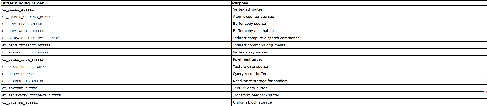
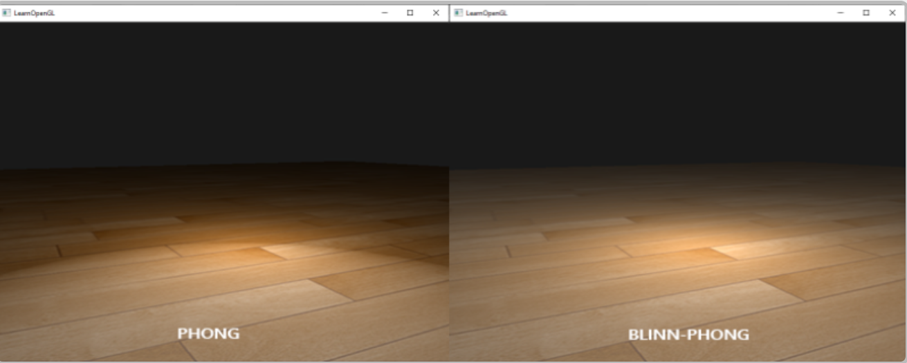
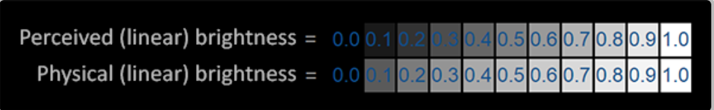
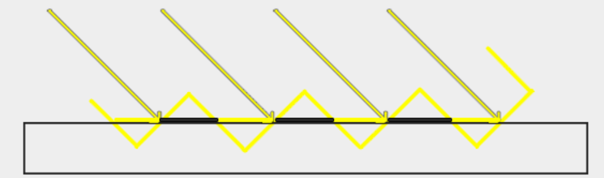
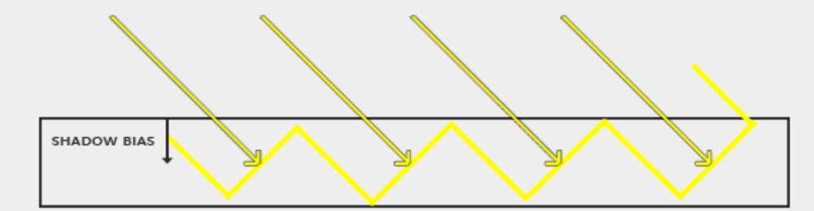
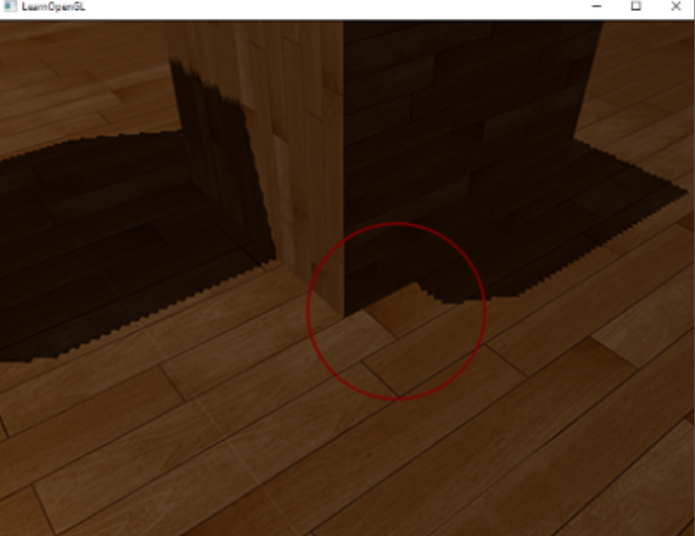
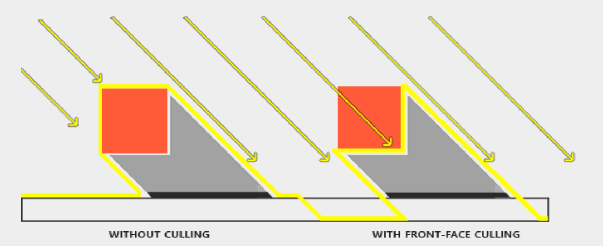
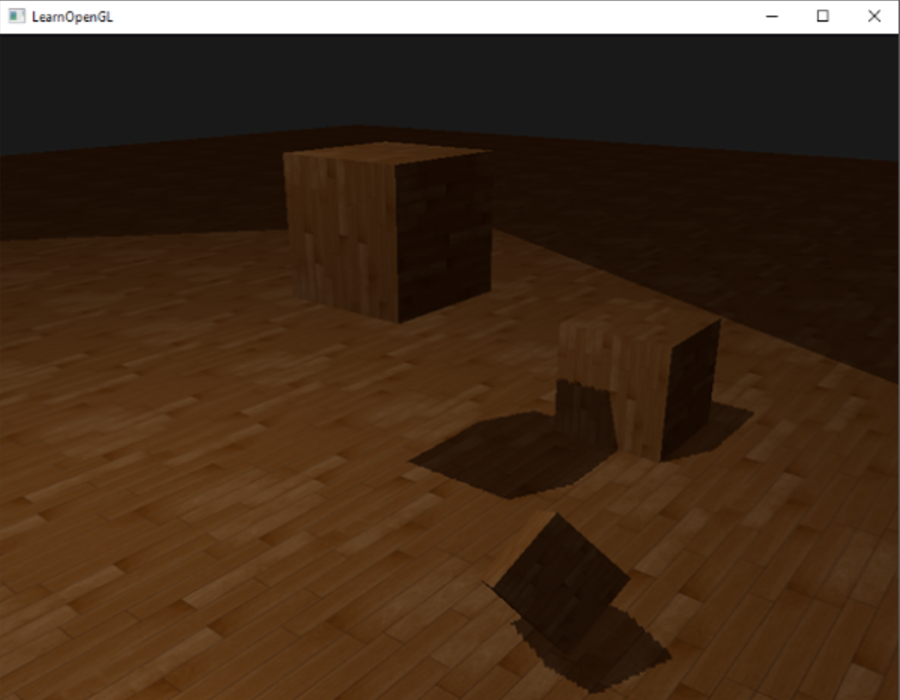
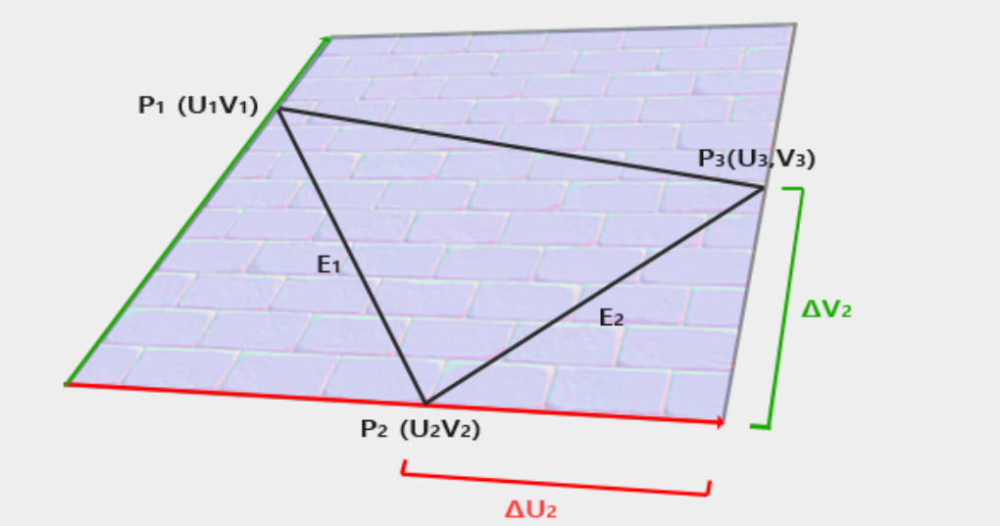
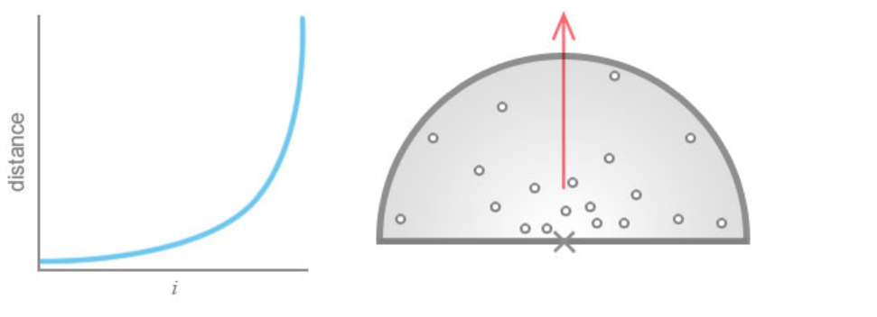

# 1.VBO  VAO  EBO
```c++
unsigned int VBO;
glGenBuffers(1, &VBO);  
```
Parameters  
n  
Specifies the number of buffer object names to be generated.

buffers  
Specifies an array in which the generated buffer object names are stored.
```c++
glBindBuffer(GL_ARRAY_BUFFER, VBO);  
```
Parameters  
target  
Specifies the target to which the buffer object is bound. The symbolic constant must be GL_ARRAY_BUFFER, GL_COPY_READ_BUFFER, GL_COPY_WRITE_BUFFER, GL_ELEMENT_ARRAY_BUFFER, GL_PIXEL_PACK_BUFFER, GL_PIXEL_UNPACK_BUFFER, GL_TRANSFORM_FEEDBACK_BUFFER, or GL_UNIFORM_BUFFER.

buffer  
Specifies the name of a buffer object.
```c++
glBufferData(GL_ARRAY_BUFFER, sizeof(vertices), vertices, GL_STATIC_DRAW);
```
```c++
void glBufferData(	GLenum target,
 	GLsizeiptr size,
 	const void * data,
 	GLenum usage);
```
Parameters  
target  
Specifies the target to which the buffer object is bound for glBufferData, which must be one of the buffer binding targets in the following table:

size  
Specifies the size in bytes of the buffer object's new data store.  
data  
Specifies a pointer to data that will be copied into the data store for initialization, or NULL if no data is to be copied.  
usage  
Specifies the expected usage pattern of the data store. The symbolic constant must be GL_STREAM_DRAW, GL_STREAM_READ, GL_STREAM_COPY, GL_STATIC_DRAW, GL_STATIC_READ, GL_STATIC_COPY, GL_DYNAMIC_DRAW, GL_DYNAMIC_READ, or GL_DYNAMIC_COPY.  
```c++
glVertexAttribPointer(0, 3, GL_FLOAT, GL_FALSE, 3 * sizeof(float), (void*)0);
```
Parameters  
index  
Specifies the index of the generic vertex attribute to be modified.(顶点属性所在的位置，在这里postion信息存储在0位置)

size  
Specifies the number of components per generic vertex attribute. Must be 1, 2, 3, 4. Additionally, the symbolic constant GL_BGRA is accepted by glVertexAttribPointer. The initial value is 4.（这里的positon信息只有3个分量）

type  
Specifies the data type of each component in the array. The symbolic constants GL_BYTE, GL_UNSIGNED_BYTE, GL_SHORT, GL_UNSIGNED_SHORT, GL_INT, and GL_UNSIGNED_INT are accepted by glVertexAttribPointer and glVertexAttribIPointer. Additionally GL_HALF_FLOAT, GL_FLOAT, GL_DOUBLE, GL_FIXED, GL_INT_2_10_10_10_REV, GL_UNSIGNED_INT_2_10_10_10_REV and GL_UNSIGNED_INT_10F_11F_11F_REV are accepted by glVertexAttribPointer. GL_DOUBLE is also accepted by glVertexAttribLPointer and is the only token accepted by the type parameter for that function. The initial value is GL_FLOAT.（这里的postion信息都是float）

normalized  
For glVertexAttribPointer, specifies whether fixed-point data values should be normalized (GL_TRUE) or converted directly as fixed-point values (GL_FALSE) when they are accessed.  

stride  
Specifies the byte offset between consecutive generic vertex attributes. If stride is 0, the generic vertex attributes are understood to be tightly packed in the array. The initial value is 0.  

pointer  
Specifies a offset of the first component of the first generic vertex attribute in the array in the data store of the buffer currently bound to the GL_ARRAY_BUFFER target. The initial value is 0.  
一个最简单的绘制流程如下：
```c++
unsigned int VBO;
glGenBuffers(1, &VBO);  
//now transform your vertex array to buffer
glBufferData(GL_ARRAY_BUFFER, sizeof(vertices), vertices, GL_STATIC_DRAW);
//tell opengl how to explain  your vertex attribute data
glVertexAttribPointer(0, 3, GL_FLOAT, GL_FALSE, 3 * sizeof(float), (void*)0); //this only explain how to explain the data on location 0
glEnableVertexAttribArray(0);  //enable your vertex data so it can be explain
//  use our shader program when we want to render an object
glUseProgram(shaderProgram);
// now draw the object 
someOpenGLFunctionThatDrawsOurTriangle();
```
VAO是存储上述VBO一系列$glVertexAttribPointer$设置的$buffer \ object$,避免之后每次要绘制的时候，VBO这套流程还要重新设置一遍，简便了流程，最简单的流程如下:  
```c++
unsigned int VAO;
glGenVertexArrays(1, &VAO);  
glBindVertexArray(VAO);
glBindBuffer(GL_ARRAY_BUFFER, VBO);
glBufferData(GL_ARRAY_BUFFER, sizeof(vertices), vertices, GL_STATIC_DRAW);
glVertexAttribPointer(0, 3, GL_FLOAT, GL_FALSE, 3 * sizeof(float), (void*)0);
glEnableVertexAttribArray(0);  
[...]
glUseProgram(shaderProgram);
glBindVertexArray(VAO);
someOpenGLFunctionThatDrawsOurTriangle();   
```
***
```c++
glDrawArrays(GL_TRIANGLES, 0, 3);
```
Parameters  
mode  
Specifies what kind of primitives to render. Symbolic constants GL_POINTS, GL_LINE_STRIP, GL_LINE_LOOP, GL_LINES, GL_LINE_STRIP_ADJACENCY, GL_LINES_ADJACENCY, GL_TRIANGLE_STRIP, GL_TRIANGLE_FAN, GL_TRIANGLES, GL_TRIANGLE_STRIP_ADJACENCY, GL_TRIANGLES_ADJACENCY and GL_PATCHES are accepted.  

first  
Specifies the starting index in the enabled arrays.  

count  
Specifies the number of indices to be rendered.  

```c++
glBindBuffer(GL_ELEMENT_ARRAY_BUFFER, EBO);
glDrawElements(GL_TRIANGLES, 6, GL_UNSIGNED_INT, 0);
```
Parameters  
mode  
Specifies what kind of primitives to render. Symbolic constants GL_POINTS, GL_LINE_STRIP, GL_LINE_LOOP, GL_LINES, GL_LINE_STRIP_ADJACENCY, GL_LINES_ADJACENCY, GL_TRIANGLE_STRIP, GL_TRIANGLE_FAN, GL_TRIANGLES, GL_TRIANGLE_STRIP_ADJACENCY, GL_TRIANGLES_ADJACENCY and GL_PATCHES are accepted.

count  
Specifies the number of elements to be rendered.

type  
Specifies the type of the values in indices. Must be one of GL_UNSIGNED_BYTE, GL_UNSIGNED_SHORT, or GL_UNSIGNED_INT.

indices  
Specifies a pointer to the location where the indices are stored.  

EBO是存储绘制顶点信息的索引的$buffer\  object$.这样就无需在绘制图形的时候需要重复的顶点信息了，举例如下：
```c++
float vertices[] = {
     0.5f,  0.5f, 0.0f,  // top right
     0.5f, -0.5f, 0.0f,  // bottom right
    -0.5f, -0.5f, 0.0f,  // bottom left
    -0.5f,  0.5f, 0.0f   // top left 
};
unsigned int indices[] = {  // note that we start from 0!
    0, 1, 3,   // first triangle
    1, 2, 3    // second triangle
}; 
```
最简单的一个实例流程如下（注意需要和VAO一起使用，因为这个类似于$vertexattribute$也是属于VAO的一部分）：
```c++
// ..:: Initialization code :: ..
// 1. bind Vertex Array Object
glBindVertexArray(VAO);
// 2. copy our vertices array in a vertex buffer for OpenGL to use
glBindBuffer(GL_ARRAY_BUFFER, VBO);
glBufferData(GL_ARRAY_BUFFER, sizeof(vertices), vertices, GL_STATIC_DRAW);
// 3. copy our index array in a element buffer for OpenGL to use
glBindBuffer(GL_ELEMENT_ARRAY_BUFFER, EBO);
glBufferData(GL_ELEMENT_ARRAY_BUFFER, sizeof(indices), indices, GL_STATIC_DRAW);
// 4. then set the vertex attributes pointers
glVertexAttribPointer(0, 3, GL_FLOAT, GL_FALSE, 3 * sizeof(float), (void*)0);
glEnableVertexAttribArray(0);  

[...]
  
// ..:: Drawing code (in render loop) :: ..
glUseProgram(shaderProgram);
glBindVertexArray(VAO);
glDrawElements(GL_TRIANGLES, 6, GL_UNSIGNED_INT, 0);
glBindVertexArray(0);
```
***
如何创建一个shaderprogram并且使用，首先在OpenGL的渲染管线中，必须指定我们编写的shader是vertex shader 和 fragment shader,其他的渲染管线都已经内置好了
```c++
unsigned int vertexShader;
vertexShader = glCreateShader(GL_VERTEX_SHADER);
```
Parameters  
shaderType  
Specifies the type of shader to be created. Must be one of GL_COMPUTE_SHADER, GL_VERTEX_SHADER, GL_TESS_CONTROL_SHADER, GL_TESS_EVALUATION_SHADER, GL_GEOMETRY_SHADER, or GL_FRAGMENT_SHADER.

```c++
glShaderSource(vertexShader, 1, &vertexShaderSource, NULL);
glCompileShader(vertexShader);
```
shader  
Specifies the handle of the shader object whose source code is to be replaced.

count  
Specifies the number of elements in the string and length arrays.

string  
Specifies an array of pointers to strings containing the source code to be loaded into the shader.

length  
Specifies an array of string lengths.(历史原因，已经弃用，直接写NULL)

```c++
unsigned int fragmentShader;
fragmentShader = glCreateShader(GL_FRAGMENT_SHADER);
glShaderSource(fragmentShader, 1, &fragmentShaderSource, NULL);
glCompileShader(fragmentShader);
```
将创建并且编译好的shader link到同一个shader program中  
```c++
unsigned int shaderProgram;
shaderProgram = glCreateProgram();
glAttachShader(shaderProgram, vertexShader);
glAttachShader(shaderProgram, fragmentShader);
glLinkProgram(shaderProgram);
```
激活使用请用  
```c++
glUseProgram(shaderProgram);
```
******
# 2.GSLS语言使用
```c++
#version version_number
in type in_variable_name;
in type in_variable_name;

out type out_variable_name;
  
uniform type uniform_name;
  
void main()
{
  // process input(s) and do some weird graphics stuff
  ...
  // output processed stuff to output variable
  out_variable_name = weird_stuff_we_processed;
}
```
详情可以链接<https://learnopengl.com/Getting-started/Shaders>  
*****************
# 3.Texture

texture的loading过程有一开源库已经封装好了，具体请看<https://learnopengl.com/Getting-started/Textures>  

OpenGL中texture的创建过程如下：
```c++
unsigned int texture;
glGenTextures(1, &texture);  
```
Parameters  
n  
Specifies the number of texture names to be generated.

textures  
Specifies an array in which the generated texture names are stored.
```c++
glBindTexture(GL_TEXTURE_2D, texture);  
```
Parameters  
target  
Specifies the target to which the texture is bound. Must be one of GL_TEXTURE_1D, GL_TEXTURE_2D, GL_TEXTURE_3D, GL_TEXTURE_1D_ARRAY, GL_TEXTURE_2D_ARRAY, GL_TEXTURE_RECTANGLE, GL_TEXTURE_CUBE_MAP, GL_TEXTURE_CUBE_MAP_ARRAY, GL_TEXTURE_BUFFER, GL_TEXTURE_2D_MULTISAMPLE or GL_TEXTURE_2D_MULTISAMPLE_ARRAY.

texture  
Specifies the name of a texture.
```c++
glTexImage2D(GL_TEXTURE_2D, 0, GL_RGB, width, height, 0, GL_RGB, GL_UNSIGNED_BYTE, data);
glGenerateMipmap(GL_TEXTURE_2D);
```
Parameters  
target  
Specifies the target texture. Must be GL_TEXTURE_2D, GL_PROXY_TEXTURE_2D, GL_TEXTURE_1D_ARRAY, GL_PROXY_TEXTURE_1D_ARRAY, GL_TEXTURE_RECTANGLE, GL_PROXY_TEXTURE_RECTANGLE, GL_TEXTURE_CUBE_MAP_POSITIVE_X, GL_TEXTURE_CUBE_MAP_NEGATIVE_X, GL_TEXTURE_CUBE_MAP_POSITIVE_Y, GL_TEXTURE_CUBE_MAP_NEGATIVE_Y, GL_TEXTURE_CUBE_MAP_POSITIVE_Z, GL_TEXTURE_CUBE_MAP_NEGATIVE_Z, or GL_PROXY_TEXTURE_CUBE_MAP.

level  
Specifies the level-of-detail number. Level 0 is the base image level. Level n is the nth mipmap reduction image. If target is GL_TEXTURE_RECTANGLE or GL_PROXY_TEXTURE_RECTANGLE, level must be 0.

internalformat  
Specifies the number of color components in the texture. Must be one of base internal formats given in Table 1, one of the sized internal formats given in Table 2, or one of the compressed internal formats given in Table 3, below.

width  
Specifies the width of the texture image. All implementations support texture images that are at least 1024 texels wide.

height  
Specifies the height of the texture image, or the number of layers in a texture array, in the case of the GL_TEXTURE_1D_ARRAY and GL_PROXY_TEXTURE_1D_ARRAY targets. All implementations support 2D texture images that are at least 1024 texels high, and texture arrays that are at least 256 layers deep.

border  
This value must be 0.

format  
Specifies the format of the pixel data. The following symbolic values are accepted: GL_RED, GL_RG, GL_RGB, GL_BGR, GL_RGBA, GL_BGRA, GL_RED_INTEGER, GL_RG_INTEGER, GL_RGB_INTEGER, GL_BGR_INTEGER, GL_RGBA_INTEGER, GL_BGRA_INTEGER, GL_STENCIL_INDEX, GL_DEPTH_COMPONENT, GL_DEPTH_STENCIL.

type  
Specifies the data type of the pixel data. The following symbolic values are accepted: GL_UNSIGNED_BYTE, GL_BYTE, GL_UNSIGNED_SHORT, GL_SHORT, GL_UNSIGNED_INT, GL_INT, GL_HALF_FLOAT, GL_FLOAT, GL_UNSIGNED_BYTE_3_3_2, GL_UNSIGNED_BYTE_2_3_3_REV, GL_UNSIGNED_SHORT_5_6_5, GL_UNSIGNED_SHORT_5_6_5_REV, GL_UNSIGNED_SHORT_4_4_4_4, GL_UNSIGNED_SHORT_4_4_4_4_REV, GL_UNSIGNED_SHORT_5_5_5_1, GL_UNSIGNED_SHORT_1_5_5_5_REV, GL_UNSIGNED_INT_8_8_8_8, GL_UNSIGNED_INT_8_8_8_8_REV, GL_UNSIGNED_INT_10_10_10_2, and GL_UNSIGNED_INT_2_10_10_10_REV.

data  
Specifies a pointer to the image data in memory.

在opengl中创建的如下最基本示例如下：   
```c++
unsigned int texture;
glGenTextures(1, &texture);
glBindTexture(GL_TEXTURE_2D, texture);
// set the texture wrapping/filtering options (on the currently bound texture object)
glTexParameteri(GL_TEXTURE_2D, GL_TEXTURE_WRAP_S, GL_REPEAT);	
glTexParameteri(GL_TEXTURE_2D, GL_TEXTURE_WRAP_T, GL_REPEAT);
glTexParameteri(GL_TEXTURE_2D, GL_TEXTURE_MIN_FILTER, GL_LINEAR_MIPMAP_LINEAR);
glTexParameteri(GL_TEXTURE_2D, GL_TEXTURE_MAG_FILTER, GL_LINEAR);
// load and generate the texture
int width, height, nrChannels;
unsigned char *data = stbi_load("container.jpg", &width, &height, &nrChannels, 0);
if (data)
{
    glTexImage2D(GL_TEXTURE_2D, 0, GL_RGB, width, height, 0, GL_RGB, GL_UNSIGNED_BYTE, data);
    glGenerateMipmap(GL_TEXTURE_2D);
}
else
{
    std::cout << "Failed to load texture" << std::endl;
}
stbi_image_free(data);
```

在shader中获取texture的步骤如下：
```GLSL
#version 330 core
out vec4 FragColor;
  
in vec3 ourColor;
in vec2 TexCoord;

uniform sampler2D ourTexture; //set a uniform variable to get and set the texture

void main()
{
    FragColor = texture(ourTexture, TexCoord); //use the built-in function to sample the texture
}
```

注意该uniform variable texture需要set之后才会同步、uniform variable的set 在后续内容
********
# 4.coordinate in OpenGL  
model matrix 将模型从模型空间转换到世界空间  
view matrix 将模型从世界空间转换到观察者空间  
project matrix 将观察者空间转换到裁剪空间  
裁剪空间要转换到NDC空间需要经历透视除法  
NDC转换到屏幕空间需要一个视口转换矩阵  
裁剪剔除的时候会在透视除法之前，将所有的vectexr如下：  
x<sub>clip</sub>>w<sub>clip</sub> || y<sub>clip</sub>>w<sub>clip</sub> || 
z<sub>clip</sub>>w<sub>clip</sub> 均会被丢弃

在vertex shader中会完成mpv的转换:  
```GLSL
#version 330 core
layout (location = 0) in vec3 aPos;

uniform mat4 model;
uniform mat4 view;
uniform mat4 projection;

void main()
{
    gl_Position = projection * view * model * vec4(aPos, 1.0);
} 
```

***
# 5.Camera  
在OpenGL中定义一个相机需要三个参数，Camara derection(由摄像机位置指向场景的方向向量)，Right axis（右侧方向向量），Up axis (上侧方向向量)，三个向量彼此正交

***
# 6.Color  
OpenGL中color由三个分量表示R、G、B,每个分量8bit,反应物体对于这三种光的反射率，
light也由三个分量表示R、G、B,表示这三种光的强度，因此计算物体颜色如下：  
```GLSL
glm::vec3 lightColor(0.33f, 0.42f, 0.18f);
glm::vec3 toyColor(1.0f, 0.5f, 0.31f);
glm::vec3 result = lightColor * toyColor; // = (0.33f, 0.21f, 0.06f);
```
***
# 7.Uniform  
```c++
int vertexColorLocation = glGetUniformLocation(shaderProgram, "ourColor");
glUseProgram(shaderProgram);
glUniform4f(vertexColorLocation, 0.0f, greenValue, 0.0f, 1.0f);
```

```c++
GLint glGetUniformLocation(	GLuint program,
 	const GLchar *name);
```
Parameters  
program  
Specifies the program object to be queried.

name  
Points to a null terminated string containing the name of the uniform variable whose location is to be queried.

```
glUniform — Specify the value of a uniform variable for the current program object
```
glUniform 针对不同的uniform 变量有不同的设置该值的形式，具体请参阅<https://registry.khronos.org/OpenGL-Refpages/gl4/html/glUniform.xhtml>  
所以设置一个uniform变量的流程为：  
```c++
float timeValue = glfwGetTime();
float greenValue = (sin(timeValue) / 2.0f) + 0.5f;
int vertexColorLocation = glGetUniformLocation(shaderProgram, "ourColor");//find the location of uniform variable in the special shader program;
glUseProgram(shaderProgram);//active the special shader program
glUniform4f(vertexColorLocation, 0.0f, greenValue, 0.0f, 1.0f);//set the value of uniform variable
```
***
# 8.Basic Lighting  
Phong lighting model:  将光照分为三个部分，ambient lighting、diffuse lighting、 specular lighting  

$ambient \ lighting$
```GLSL
void main()
{
    float ambientStrength = 0.1;
    vec3 ambient = ambientStrength * lightColor;

    vec3 result = ambient * objectColor;
    FragColor = vec4(result, 1.0);
}  
```
$diffuse \ lighting$
```GLSL
vec3 norm = normalize(Normal);
vec3 lightDir = normalize(lightPos - FragPos);
float diff = max(dot(norm, lightDir), 0.0);
vec3 diffuse = diff * lightColor;  
```
关于模型空间的发现转换到世界空间需要用$model\  matrix$的逆转置 具体矩阵推导请看<http://www.lighthouse3d.com/tutorials/glsl-12-tutorial/the-normal-matrix/>  

$specular\  lighting$  
```GLSL
uniform vec3 viewPos;
lightingShader.setVec3("viewPos", camera.Position); 
float specularStrength = 0.5;
vec3 viewDir = normalize(viewPos - FragPos);
vec3 reflectDir = reflect(-lightDir, norm);  
float spec = pow(max(dot(viewDir, reflectDir), 0.0), 32);
vec3 specular = specularStrength * spec * lightColor;  
```
最终结果是：
```GLSL
vec3 result = (ambient + diffuse + specular) * objectColor;
FragColor = vec4(result, 1.0);
```
***********
# 9.Materials
与光照类似，将Material分为三个部分，对应ambient、diffuse、specular  
```GLSL
#version 330 core
struct Material {
    vec3 ambient;
    vec3 diffuse;
    vec3 specular;
    float shininess;
}; 
  
uniform Material material;
```
光照也可以设置为：  
```GLSL
struct Light {
    vec3 position;
  
    vec3 ambient;
    vec3 diffuse;
    vec3 specular;
};

uniform Light light;  
```
由于光照模型是$ lightingcolor* objectcolor$,而$struct Light$现在是由$vec3 ambient,vec3 diffuse, vec3 specular$产生，注意最好不要使得$ambient+diffuse+specular$的结果超出$vec3(1.0)$,原因在于如果$object color$如果是$vec3(1.0,1.0,1.0)$在特殊的情况下可能使得$shading$ 结果超出$vec3(1.0,1.0,1.0),$
同样也最好检查一下material的情况


由此可以更精确的控制$shading$ 结果
************
# 10.Lighting maps
$material$ 可以由贴图产生，例子如下
```GLSL
struct Material {
    sampler2D diffuse;
    vec3      specular;
    float     shininess;
}; 
...
in vec2 TexCoords;
```
所有的材质都可以由贴图产生
```GLSL
struct Material {
    sampler2D diffuse;
    sampler2D specular;
    float     shininess;
};  
```
$ambient$是可以用$diffuse lighting$ 乘以一个非常小的系数来替代

*********
# 11.Light casters  
Directional Light
```GLSL
struct Light {
    // vec3 position; // no longer necessary when using directional lights.
    vec3 direction;
  
    vec3 ambient;
    vec3 diffuse;
    vec3 specular;
};
```
Point lights  
可以用一个公式模拟
$$
F_{att} = \frac{1.0}{K_c + K_l \cdot d + K_q \cdot d^2}
$$

```GLSL
struct Light {
    vec3 position;  
  
    vec3 ambient;
    vec3 diffuse;
    vec3 specular;
	
    float constant;
    float linear;
    float quadratic;
}; 
```
设置好$constant，linear，quadratic之后计算attention$，将$attention$作用于每一个光项  

Spotlight
```GLSL
struct Light {
    vec3  position;
    vec3  direction;
    float cutOff;
    ...
}; 
```
对不属于$cutOff$范围内的不进行diffuse和specular的光照计算  
```GLSL
float theta = dot(lightDir, normalize(-light.direction));
    
if(theta > light.cutOff) 
{       
  // do lighting calculations
}
else  // else, use ambient light so scene isn't completely dark outside the spotlight.
  color = vec4(light.ambient * vec3(texture(material.diffuse, TexCoords)), 1.0);
```
模拟手电光圈，可以参照公式
$$
I = \frac{\theta - \gamma}{\epsilon}
$$

```GLSL
float theta     = dot(lightDir, normalize(-light.direction));
float epsilon   = light.cutOff - light.outerCutOff; //light.cutOff is the inner radian and light.outerCutOff is the outer radian
float intensity = clamp((theta - light.outerCutOff) / epsilon, 0.0, 1.0);    
...
// we'll leave ambient unaffected so we always have a little light.
diffuse  *= intensity;
specular *= intensity;
...
```
**********
# 12. Depth testing &Stencil testing &Blending
启用深度测试
```GLSL
glEnable(GL_DEPTH_TEST); 
```
每一帧绘制前需要清空这些buffer中值
```GLSL
glClear(GL_COLOR_BUFFER_BIT | GL_DEPTH_BUFFER_BIT);  
```
```GLSL
glDepthMask(GL_FALSE);  
```
设置depth buffer中的mask值
```GLSL
glEnable(GL_DEPTH_TEST);
glDepthFunc(GL_ALWAYS); 
```
$glDepthFunc$决定了深度测试的行为

由于screen space 中的深度值不是线性的容易发生z-fighting,具体原因是如下:  
由于per project matrix 如下  
$$
\begin{bmatrix}
n & 0 & 0 & 0 \\
0 & n & 0 & 0 \\
0 & 0 & n + f & -nf \\
0 & 0 & 1 & 0
\end{bmatrix}
$$
将$Perspective\  Projection\  Matrix$乘以观察者空间的坐标然后除以w<sub>clip</sub>得到NDC坐标，在这些矩阵变换中，只有透视除法是非线性的，透视除法的W<sub>clip</sub>与透视矩阵高度相关联，观察经过透视除法之后的深度坐标与在观察者空间的深度坐标比较就能发现其中的关系  
$$
\begin{bmatrix}
x_{clip} \\
y_{clip} \\
z_{clip} \\
w_{clip}
\end{bmatrix}
= 
M_{projection}
\cdot
\begin{bmatrix}
x_{eye} \\
y_{eye} \\
z_{eye} \\
w_{eye}
\end{bmatrix}
$$
$$
\begin{bmatrix}
x_{ndc} \\
y_{ndc} \\
z_{ndc}
\end{bmatrix}
=
\begin{bmatrix}
x_{clip}/w_{clip} \\
y_{clip}/w_{clip} \\
z_{clip}/w_{clip}
\end{bmatrix}
$$
最终结果是
$$
z_n = \frac{-\frac{f + n}{f - n}z_e - \frac{2fn}{f - n}}{-z_e}
$$
具体可以参照<https://www.songho.ca/opengl/gl_projectionmatrix.html#google_vignette>

由此z-fighting 的改善方法如下：  
1.设置更高精度的z-buffer  
2.手动将调整一下在屏幕空间中的z值  
3.将near 平面放置的更远一点（不是很建议，会导致我们有点类似于上帝视角）  

启用模板测试
```GLSL
glEnable(GL_STENCIL_TEST);   
```

每次渲染前记得清除buffer值
```GLSL
glClear(GL_COLOR_BUFFER_BIT | GL_DEPTH_BUFFER_BIT | GL_STENCIL_BUFFER_BIT); 
```
```GLSL
glStencilMask(0xFF); // each bit is written to the stencil buffer as is
glStencilMask(0x00); // each bit ends up as 0 in the stencil buffer (disabling writes)
```
stencil buffer值进行模板测试的时候执行的是AND<sub>ed</sub>操作
```GLSL
glStencilFunc(GL_EQUAL, 1, 0xFF)
```

决定如何进行模板测试的行为，此示例是将stencil buffer中的值与$0xFF$进行AND<sub>ed</sub>操作，并且与1与AND<sub>ed</sub>操作得到的值进行GL_EQUAL操作，相等即通过模板测试  
具体可以参阅<https://registry.khronos.org/OpenGL-Refpages/gl4/html/glStencilFunc.xhtml>

```GLSL
glStencilOp(GLenum sfail, GLenum dpfail, GLenum dppass)
```
sfail: action to take if the stencil test fails.  
dpfail: action to take if the stencil test passes, but the depth test fails.  
dppass: action to take if both the stencil and the depth test pass.  

启用 Blending

```GLSL
glEnable(GL_BLEND);  
```
```GLSL
glBlendFunc(GL_SRC_ALPHA, GL_ONE_MINUS_SRC_ALPHA);  
```
此函数决定如何进行Blending，如果想要alpha值与RGB值执行不同的blending,请启用如下函数：
```GLSL
glBlendFuncSeparate(GL_SRC_ALPHA, GL_ONE_MINUS_SRC_ALPHA, GL_ONE, GL_ZERO);
```
具体使用请参阅<https://registry.khronos.org/OpenGL-Refpages/gl4/html/glBlendFuncSeparate.xhtml>

透明物体的渲染涉及一个排序问题，先渲染不透明物体，然后将透明物体进行排序，由远及近绘制，有种不需要排序也可以绘制的OIT方法，大概思路如下,对最终的pixel的贡献由本身的距离权重还有alpha值权重决定。可以参见<https://jcgt.org/published/0002/02/09/>此篇文章
**********
# 13 Face culling

启用face culling 
```GLSL
glEnable(GL_CULL_FACE);  
```
决定culling 行为
```GLSL
glCullFace(GL_FRONT);  
```
决定face 行为
```GLSL
glFrontFace(GL_CCW);  
```
********
# 14 Framebuffers
```GLSL
unsigned int fbo;
glGenFramebuffers(1, &fbo);
glBindFramebuffer(GL_FRAMEBUFFER, fbo);  
```
设置bind到默认framebuffer,即没启用输出到屏幕的buffer

framebuffer需要满足以下条件才可以使用  
We have to attach at least one buffer (color, depth or stencil buffer).  
There should be at least one color attachment.  
All attachments should be complete as well (reserved memory).  
Each buffer should have the same number of samples.

在上述的条件满足之后，调用
```GLSL
glFramebufferTexture2D(GL_FRAMEBUFFER, GL_COLOR_ATTACHMENT0, GL_TEXTURE_2D, texture, 0);  
```
参数解释如下：   

target: the framebuffer type we're targeting (draw, read or both).  
attachment: the type of attachment we're going to attach. Right now we're attaching a color attachment. Note that the 0 at the end suggests we can attach more than 1 color attachment. We'll get to that in a later chapter.  
textarget: the type of the texture you want to attach.  
texture: the actual texture to attach.  
level: the mipmap level. We keep this at 0.

进行texture attachment bounding
```GLSL
unsigned int texture;
glGenTextures(1, &texture);
glBindTexture(GL_TEXTURE_2D, texture);
  
glTexImage2D(GL_TEXTURE_2D, 0, GL_RGB, 800, 600, 0, GL_RGB, GL_UNSIGNED_BYTE, NULL);

glTexParameteri(GL_TEXTURE_2D, GL_TEXTURE_MIN_FILTER, GL_LINEAR);
glTexParameteri(GL_TEXTURE_2D, GL_TEXTURE_MAG_FILTER, GL_LINEAR);  
glTexImage2D(
  GL_TEXTURE_2D, 0, GL_DEPTH24_STENCIL8, 800, 600, 0, 
  GL_DEPTH_STENCIL, GL_UNSIGNED_INT_24_8, NULL
);

glFramebufferTexture2D(GL_FRAMEBUFFER, GL_DEPTH_STENCIL_ATTACHMENT, GL_TEXTURE_2D, texture, 0); 
```
如果该attachment不需要直接读取的话，更建议用Renderbuffer object attachments
```GLSL
unsigned int rbo;
glGenRenderbuffers(1, &rbo);
glBindRenderbuffer(GL_RENDERBUFFER, rbo);  
glRenderbufferStorage(GL_RENDERBUFFER, GL_DEPTH24_STENCIL8, 800, 600);
glFramebufferRenderbuffer(GL_FRAMEBUFFER, GL_DEPTH_STENCIL_ATTACHMENT, GL_RENDERBUFFER, rbo);  
```


一个简单的示例如下：
```GLSL
unsigned int framebuffer;
glGenFramebuffers(1, &framebuffer);
glBindFramebuffer(GL_FRAMEBUFFER, framebuffer);    

// generate texture
unsigned int textureColorbuffer;
glGenTextures(1, &textureColorbuffer);
glBindTexture(GL_TEXTURE_2D, textureColorbuffer);
glTexImage2D(GL_TEXTURE_2D, 0, GL_RGB, 800, 600, 0, GL_RGB, GL_UNSIGNED_BYTE, NULL);
glTexParameteri(GL_TEXTURE_2D, GL_TEXTURE_MIN_FILTER, GL_LINEAR );
glTexParameteri(GL_TEXTURE_2D, GL_TEXTURE_MAG_FILTER, GL_LINEAR);
glBindTexture(GL_TEXTURE_2D, 0);

// attach it to currently bound framebuffer object
glFramebufferTexture2D(GL_FRAMEBUFFER, GL_COLOR_ATTACHMENT0, GL_TEXTURE_2D, textureColorbuffer, 0); 

// generate Renderbuffer object
unsigned int rbo;
glGenRenderbuffers(1, &rbo);
glBindRenderbuffer(GL_RENDERBUFFER, rbo); 
glRenderbufferStorage(GL_RENDERBUFFER, GL_DEPTH24_STENCIL8, 800, 600);  
glBindRenderbuffer(GL_RENDERBUFFER, 0);
// attach it to currently bound framebuffer object
glFramebufferRenderbuffer(GL_FRAMEBUFFER, GL_DEPTH_STENCIL_ATTACHMENT, GL_RENDERBUFFER, rbo);

[...]

// bind to framebuffer and draw scene as we normally would to color texture 
glBindFramebuffer(GL_FRAMEBUFFER, framebuffer);

[...]
//the shading results will write in color texture attachment in framebuffer ,so we then can bind framebuffer to default, and then sample from the color texture attachment in framebuffer 
```
详情可以参阅代码<https://learnopengl.com/code_viewer_gh.php?code=src/4.advanced_opengl/5.1.framebuffers/framebuffers.cpp>


# 15 cubemap

create a cubmap
```GLSL
unsigned int textureID;
glGenTextures(1, &textureID);
glBindTexture(GL_TEXTURE_CUBE_MAP, textureID);
```

loading a cubmap
```GLSL
  unsigned int textureID;
    glGenTextures(1, &textureID);
    glBindTexture(GL_TEXTURE_CUBE_MAP, textureID);

    int width, height, nrChannels;
    for (unsigned int i = 0; i < faces.size(); i++)
    {
        unsigned char *data = stbi_load(faces[i].c_str(), &width, &height, &nrChannels, 0);
        if (data)
        {
            glTexImage2D(GL_TEXTURE_CUBE_MAP_POSITIVE_X + i, 
                         0, GL_RGB, width, height, 0, GL_RGB, GL_UNSIGNED_BYTE, data
            );
            stbi_image_free(data);
        }
        else
        {
            std::cout << "Cubemap tex failed to load at path: " << faces[i] << std::endl;
            stbi_image_free(data);
        }
    }
    glTexParameteri(GL_TEXTURE_CUBE_MAP, GL_TEXTURE_MIN_FILTER, GL_LINEAR);
    glTexParameteri(GL_TEXTURE_CUBE_MAP, GL_TEXTURE_MAG_FILTER, GL_LINEAR);
    glTexParameteri(GL_TEXTURE_CUBE_MAP, GL_TEXTURE_WRAP_S, GL_CLAMP_TO_EDGE);
    glTexParameteri(GL_TEXTURE_CUBE_MAP, GL_TEXTURE_WRAP_T, GL_CLAMP_TO_EDGE);
    glTexParameteri(GL_TEXTURE_CUBE_MAP, GL_TEXTURE_WRAP_R, GL_CLAMP_TO_EDGE);
```

关于cubemap的texture coordinate直接定义在NDC空间的位置，因此不需要经历mvp转换以及透视除法；

可以在shader中实现reflection或者fraction效果
```GLSL
#version 330 core
out vec4 FragColor;

in vec3 Normal;
in vec3 Position;

uniform vec3 cameraPos;
uniform samplerCube skybox;

void main()
{    
    vec3 I = normalize(Position - cameraPos);
    vec3 R = reflect(I, normalize(Normal));
    FragColor = vec4(texture(skybox, R).rgb, 1.0);
}
```
**********
# 16 Advanced Data& Advanced GLSL
本章节的内容在于如何更精细的管理buffer，其中包括GPU上内存分配、内存拷贝、内存赋值以及GLSL内置的一些变量可以在渲染管线的每个不同阶段获取不同的内置变量以及修改某个部分的值   
详情请参阅<https://learnopengl.com/Advanced-OpenGL/Advanced-GLSL>
*********
# 17 Instancing
绘制大量相同的物体的时候可以用
```c
void glDrawElementsInstanced(	GLenum mode,
 	GLsizei count,
 	GLenum type,
 	const void * indices,
 	GLsizei instancecount);
```
Parameters  
mode  
Specifies what kind of primitives to render. Symbolic constants GL_POINTS, GL_LINE_STRIP, GL_LINE_LOOP, GL_LINES, GL_LINE_STRIP_ADJACENCY, GL_LINES_ADJACENCY, GL_TRIANGLE_STRIP, GL_TRIANGLE_FAN, GL_TRIANGLES, GL_TRIANGLE_STRIP_ADJACENCY, GL_TRIANGLES_ADJACENCY and GL_PATCHES are accepted.  

count  
Specifies the number of elements to be rendered.  

type    
Specifies the type of the values in indices. Must be one of GL_UNSIGNED_BYTE, GL_UNSIGNED_SHORT, or GL_UNSIGNED_INT.  

indices  
Specifies a pointer to the location where the indices are stored.  

instancecount  
Specifies the number of instances of the specified range of indices to be rendered.  
示例代码：
```GLSL
instanceShader.use();
for(unsigned int i = 0; i < rock.meshes.size(); i++)
{
    glBindVertexArray(rock.meshes[i].VAO);
    glDrawElementsInstanced(
        GL_TRIANGLES, rock.meshes[i].indices.size(), GL_UNSIGNED_INT, 0, amount
    );
}
```
具体代码可以参考<https://learnopengl.com/code_viewer_gh.php?code=src/4.advanced_opengl/10.3.asteroids_instanced/asteroids_instanced.cpp>

# 18 Anti Aliasing

在OpenGL中启用MSAA
```c
glEnable(GL_MULTISAMPLE);  
```

如果想在Off-screen 中启用MSAA
```GLSL
    // configure MSAA framebuffer
    // --------------------------
    unsigned int framebuffer;
    glGenFramebuffers(1, &framebuffer);
    glBindFramebuffer(GL_FRAMEBUFFER, framebuffer);
    // create a multisampled color attachment texture
    unsigned int textureColorBufferMultiSampled;
    glGenTextures(1, &textureColorBufferMultiSampled);
    glBindTexture(GL_TEXTURE_2D_MULTISAMPLE, textureColorBufferMultiSampled);
    glTexImage2DMultisample(GL_TEXTURE_2D_MULTISAMPLE, 4, GL_RGB, SCR_WIDTH, SCR_HEIGHT, GL_TRUE);
    glBindTexture(GL_TEXTURE_2D_MULTISAMPLE, 0);
    glFramebufferTexture2D(GL_FRAMEBUFFER, GL_COLOR_ATTACHMENT0, GL_TEXTURE_2D_MULTISAMPLE, textureColorBufferMultiSampled, 0);
    // create a (also multisampled) renderbuffer object for depth and stencil attachments
    unsigned int rbo;
    glGenRenderbuffers(1, &rbo);
    glBindRenderbuffer(GL_RENDERBUFFER, rbo);
    glRenderbufferStorageMultisample(GL_RENDERBUFFER, 4, GL_DEPTH24_STENCIL8, SCR_WIDTH, SCR_HEIGHT);
    glBindRenderbuffer(GL_RENDERBUFFER, 0);
    glFramebufferRenderbuffer(GL_FRAMEBUFFER, GL_DEPTH_STENCIL_ATTACHMENT, GL_RENDERBUFFER, rbo);
```
请注意此时写入到framebuffer color texture attachment之后，不能直接读取，因为这个颜色附件的sample数量和渲染到屏幕的color texture的sample数不一样，比较方便的做法是继续创建一个framebuffer然后对其中的color texture attachment做down sample  
具体代码参见：<https://learnopengl.com/code_viewer_gh.php?code=src/4.advanced_opengl/11.2.anti_aliasing_offscreen/anti_aliasing_offscreen.cpp>

# 19 Blinn-Phong
在原本的Phong shading 中，反射向量如果与视角方向超过90会有一个很明显的一个cutoff

如果采用Blinn-Phong则不会发生此现象，用该公式用半程向量代替反射向量
$$
\vec{H} = \frac{\vec{L} + \vec{V}}{\|\vec{L} + \vec{V}\|}
$$
示例代码
```GLSL
vec3 lightDir   = normalize(lightPos - FragPos);
vec3 viewDir    = normalize(viewPos - FragPos);
vec3 halfwayDir = normalize(lightDir + viewDir);
```
在specular的指数系数中，Blinn-Phong需要设置原本在Phong中的2-4倍，才能有比较好的效果
*******
# 20 Gamma Correction
人眼对于光线的intensity 不是线性的

对于暗部我们是需要保持更多细节的，如果我们对原本的lighting vector 进行gamma correction
$$
(0.5, 0.0, 0.0, 0.0)^{1/2.2} = (0.5, 0.0, 0.0, 0.0)^{0.45} = (0.73, 0.0, 0.0, 0.0).
$$
这样就可以在暗部环境下，提升亮感
OpenGL中默认framebuffer中启用gamma correction
```c
glEnable(GL_FRAMEBUFFER_SRGB); 
```
自己创建的framebuffer在fragment shader手动修改
```GLSL
void main()
{
    // do super fancy lighting in linear space
    [...]
    // apply gamma correction
    float gamma = 2.2;
    FragColor.rgb = pow(fragColor.rgb, vec3(1.0/gamma));
}
```

# 21 Shadow Mapping

shadow map本身就是一个在光源空间中的一个渲染结果，所以需要定义光源空间中的mvp矩阵，model矩阵和从相机视角的一致，所以应该是从世界空间经历光源视角的view matrix 以及 project matrix转换，如果是正交矩阵投影，不需要经历透视除法。


创建一个framebuffer object,然后将光源空间的渲染结果存储到depth map中
```c
const unsigned int SHADOW_WIDTH = 1024, SHADOW_HEIGHT = 1024;

unsigned int depthMap;
glGenTextures(1, &depthMap);
glBindTexture(GL_TEXTURE_2D, depthMap);
glTexImage2D(GL_TEXTURE_2D, 0, GL_DEPTH_COMPONENT, 
             SHADOW_WIDTH, SHADOW_HEIGHT, 0, GL_DEPTH_COMPONENT, GL_FLOAT, NULL);
glTexParameteri(GL_TEXTURE_2D, GL_TEXTURE_MIN_FILTER, GL_NEAREST);
glTexParameteri(GL_TEXTURE_2D, GL_TEXTURE_MAG_FILTER, GL_NEAREST);
glTexParameteri(GL_TEXTURE_2D, GL_TEXTURE_WRAP_S, GL_REPEAT); 
glTexParameteri(GL_TEXTURE_2D, GL_TEXTURE_WRAP_T, GL_REPEAT);  
```

depth map的结果不需要color texture attachment,所以不需要渲染出来，通过glDrawBuffer(GL_NONE);
glReadBuffer(GL_NONE);告知OpenGL 不需要渲染；
```GLSL
glBindFramebuffer(GL_FRAMEBUFFER, depthMapFBO);
glFramebufferTexture2D(GL_FRAMEBUFFER, GL_DEPTH_ATTACHMENT, GL_TEXTURE_2D, depthMap, 0);
glDrawBuffer(GL_NONE);
glReadBuffer(GL_NONE);
glBindFramebuffer(GL_FRAMEBUFFER, 0);  
```

大致流程如下：
```c
simpleDepthShader.use();
glUniformMatrix4fv(lightSpaceMatrixLocation, 1, GL_FALSE, glm::value_ptr(lightSpaceMatrix));

glViewport(0, 0, SHADOW_WIDTH, SHADOW_HEIGHT);
glBindFramebuffer(GL_FRAMEBUFFER, depthMapFBO);
    glClear(GL_DEPTH_BUFFER_BIT);
    RenderScene(simpleDepthShader);
glBindFramebuffer(GL_FRAMEBUFFER, 0);  
```

想要计算某个点是否在shadow中，需要知道它在光源空间中的位置，所以在正常绘制中需要在vertex shader中获取vertex 在光源空间中的坐标 
```GLSL
void main()
{    
    vs_out.FragPos = vec3(model * vec4(aPos, 1.0));
    vs_out.Normal = transpose(inverse(mat3(model))) * aNormal;
    vs_out.TexCoords = aTexCoords;
    vs_out.FragPosLightSpace = lightSpaceMatrix * vec4(vs_out.FragPos, 1.0);
    gl_Position = projection * view * vec4(vs_out.FragPos, 1.0);
}
```
shadow的计算如下
```GLSL
float ShadowCalculation(vec4 fragPosLightSpace)
{
    // perform perspective divide
    vec3 projCoords = fragPosLightSpace.xyz / fragPosLightSpace.w;
    // transform to [0,1] range
    projCoords = projCoords * 0.5 + 0.5;
    // get closest depth value from light's perspective (using [0,1] range fragPosLight as coords)
    float closestDepth = texture(shadowMap, projCoords.xy).r; 
    // get depth of current fragment from light's perspective
    float currentDepth = projCoords.z;
    // check whether current frag pos is in shadow
    float shadow = currentDepth > closestDepth  ? 1.0 : 0.0;

    return shadow;
}  
```

shadow只影响diffuse 和 specular, 不应该影响ambient
```GLSL
   vec3 lighting = (ambient + (1.0 - shadow) * (diffuse + specular)) * color;    
```

shadow map可能存在Shadow acne和Peter panning问题，前者是因为如下原因

通过角度设置一些bias来矫正这些问题

但是仍然有问题，会导致Peter panning，是物体看起来像是悬空了

解决问题可以通过

在OpenGL中可以通过设置开启front face culling 来做到
```GLSL
glCullFace(GL_FRONT);
RenderSceneToDepthMap();
glCullFace(GL_BACK); // don't forget to reset original culling face
```
在OpenGL中会发生一些问题，如果物体不在光源的frustum中，会默认它们在阴影中

但是修复此问题只需要设置以下depth map的采样方式就行了
```GLSL
glTexParameteri(GL_TEXTURE_2D, GL_TEXTURE_WRAP_S, GL_CLAMP_TO_BORDER);
glTexParameteri(GL_TEXTURE_2D, GL_TEXTURE_WRAP_T, GL_CLAMP_TO_BORDER);
float borderColor[] = { 1.0f, 1.0f, 1.0f, 1.0f };
glTexParameterfv(GL_TEXTURE_2D, GL_TEXTURE_BORDER_COLOR, borderColor);  
```
但是仍然还会有一部分的超出光源空间far plane的处于阴影中 可以在fragment中手动修改
```GLSL
float ShadowCalculation(vec4 fragPosLightSpace)
{
    [...]
    if(projCoords.z > 1.0)
        shadow = 0.0;
    
    return shadow;
}  
```

实现软阴影可以用PCF算法
```GLSL
float shadow = 0.0;
vec2 texelSize = 1.0 / textureSize(shadowMap, 0);
for(int x = -1; x <= 1; ++x)
{
    for(int y = -1; y <= 1; ++y)
    {
        float pcfDepth = texture(shadowMap, projCoords.xy + vec2(x, y) * texelSize).r; 
        shadow += currentDepth - bias > pcfDepth ? 1.0 : 0.0;        
    }    
}
shadow /= 9.0;
```
# 22 Normal Mapping
normal map中的法线是定义在法线空间中的，需要用TBN矩阵将法线转换到世界空间中来做shading
TBN矩阵的推导如下


$$
\begin{aligned}
E_{1} &= \Delta U_{1}T + \Delta V_{1}B \\
E_{2} &= \Delta U_{2}T + \Delta V_{2}B
\end{aligned}
$$

$$
\begin{aligned}
(E_{1x}, E_{1y}, E_{1z}) &= \Delta U_1 (T_x, T_y, T_z) + \Delta V_1 (B_x, B_y, B_z) \\
(E_{2x}, E_{2y}, E_{2z}) &= \Delta U_2 (T_x, T_y, T_z) + \Delta V_2 (B_x, B_y, B_z)
\end{aligned}
$$

$$
\begin{bmatrix}
E_{1x} & E_{1y} & E_{1z} \\
E_{2x} & E_{2y} & E_{2z}
\end{bmatrix}
=
\begin{bmatrix}
\Delta U_1 & \Delta V_1 \\
\Delta U_2 & \Delta V_2
\end{bmatrix}
\cdot
\begin{bmatrix}
T_x & T_y & T_n \\
B_x & B_y & B_n
\end{bmatrix}
$$


$$
\begin{bmatrix}
T_x & T_y & T_z \\
B_x & B_y & B_z
\end{bmatrix}
=
\begin{bmatrix}
\Delta U_1 & \Delta V_1 \\
\Delta U_2 & \Delta V_2
\end{bmatrix}^{-1}
\cdot
\begin{bmatrix}
E_{1x} & E_{1y} & E_{1z} \\
E_{2x} & E_{2y} & E_{2z}
\end{bmatrix}
$$


$$
\begin{bmatrix}
T_x & T_y & T_z \\
B_x & B_y & B_z \\
N_x & N_y & N_z
\end{bmatrix}
=
\frac{1}{\Delta U_1 \Delta V_2 - \Delta U_2 \Delta V_1}
\begin{bmatrix}
-\Delta V_2 & \Delta V_1 \\
\Delta U_2 & -\Delta U_1 \\
0 & 0
\end{bmatrix}
\begin{bmatrix}
E_{1x} & E_{1y} & E_{1z} \\
E_{2x} & E_{2y} & E_{2z}
\end{bmatrix}
$$

这里的E<sub>1</sub>,E<sub>2</sub>都通过世界空间中的点坐标向量相减得到，T,B也是在世界空间的坐标来表示，计算出来的T、B、N需要做smith 正交化；

对于复杂模型，可以将光源用逆TBN矩阵转换到法线空间进行shading 计算。
**********
# 23 HDR

在光线强度太高的时候，比如说
```GLSL
glm::vec3(200.0f, 200.0f, 200.0f)
```
会导致fragment中的太多color被clamp到vec3(1.0),丢失很多亮部细节，又或者在很暗的光线环境下 需要对画面提亮来增强细节，因此需要一种方法将这些shading 结果做一个映射，让他们从$ [0, +\infty) $映射回$ [0, 1] $
```GLSL
void main()
{             
    const float gamma = 2.2;
    vec3 hdrColor = texture(hdrBuffer, TexCoords).rgb;
  
    // reinhard tone mapping
    vec3 mapped = hdrColor / (hdrColor + vec3(1.0));
    // gamma correction 
    mapped = pow(mapped, vec3(1.0 / gamma));
  
    FragColor = vec4(mapped, 1.0);
} 
```
另一种映射方式
```GLSL
uniform float exposure;

void main()
{             
    const float gamma = 2.2;
    vec3 hdrColor = texture(hdrBuffer, TexCoords).rgb;
  
    // exposure tone mapping
    vec3 mapped = vec3(1.0) - exp(-hdrColor * exposure);
    // gamma correction 
    mapped = pow(mapped, vec3(1.0 / gamma));
  
    FragColor = vec4(mapped, 1.0);
} 
```
此种方式可以通过设置exposure的值来决定是将亮部细节提取，还是增强暗部细节

# 24 Bloom

bloom的实现是通过HDR映射将亮部提取，对写入到某个texture中，对texture做一些blur，然后将此texture用于正常的渲染

# 25 Deferred Shading
Deferred Shading 需要在第一个render pass中将光照计算的信息存储起来，比如说世界空间坐标、世界空间法线、diffuse 贴图信息、specular贴图信息、这些可以存储到texture中，也就是G-BUffer

然后第二个render path中读取G-Buffer中的信息进行计算

Deffered shading的坏处在于需要更大的显存来存储这些G-BUffer 信息，而且对硬件MSAA不友好，同样的在第二个render pass中由于是同一shader program计算shading的，所以都是同一个光照模型，当然通过设置一些material属性来trick，但是这会导致G-Buffer更大；

Deferred Shading在多光源的时候可以计算光源的覆盖范围，从而对那些几乎不受某些光源影响的fragment的时候，shading 的时候忽略；
更详细的信息以及代码请参考<https://learnopengl.com/Advanced-Lighting/Deferred-Shading>

***************
# 26 SSAO
1. Generating the Sample Kernel  
+ sample positions fall within the unit hemisphere  
+ sample positions are more densely clustered towards the origin. This effectively attenuates the occlusion contribution according to distance from the kernel centre - samples closer to a point occlude it more than samples further away  

    半球采样函数如下：

```c++
for (int i = 0; i < kernelSize; ++i) {
   kernel[i] = vec3(
   random(-1.0f, 1.0f),
   random(-1.0f, 1.0f),
   random(0.0f, 1.0f)
   kernel[i].normalize();
}
```
将kernel值映射到半球分布
```c++
kernel[i] *= random(0.0f, 1.0f);
```
此采样过于均匀，实际效果是想要随着距离远离原点时采样更多，如下图所示

可以通过此来实现
```c++
   float scale = float(i) / float(kernelSize);
   scale = lerp(0.1f, 1.0f, scale * scale);
   kernel[i] *= scale;
```
2. Generating the Noise Texture

此外还需要对原本的sample进行一些随机旋转，然后获取新的sample
```c++
for (int i = 0; i < noiseSize; ++i) {
   noise[i] = vec3(
      random(-1.0f, 1.0f),
      random(-1.0f, 1.0f),
      0.0f
   );
   noise[i].normalize();
}
```
3. The SSAO shader

```GLSL
vec3 fragPos   = texture(gPosition, TexCoords).xyz;
vec3 normal    = texture(gNormal, TexCoords).rgb;
vec3 randomVec = texture(texNoise, TexCoords * noiseScale).xyz;  
```
在第一个render pass中获取观察者空间的坐标、（法线依然在法线空间） 以及之前实现的随机噪声采样
```GLSL
vec3 tangent   = normalize(randomVec - normal * dot(randomVec, normal));
vec3 bitangent = cross(normal, tangent);
mat3 TBN       = mat3(tangent, bitangent, normal);  
```
计算TBN矩阵，以便将法线空间中的采样点转换到观察者空间
```GLSL
float occlusion = 0.0;
for(int i = 0; i < kernelSize; ++i)
{
    // get sample position
    vec3 samplePos = TBN * samples[i]; // from tangent to view-space
    samplePos = fragPos + samplePos * radius; 
    
    [...]
}  
```
接下来计算sample在屏幕空间的坐标
```GLSL
vec4 offset = vec4(samplePos, 1.0);
offset      = projection * offset;    // from view to clip-space
offset.xyz /= offset.w;               // perspective divide
offset.xyz  = offset.xyz * 0.5 + 0.5; // transform to range 0.0 - 1.0  
```

进行遮挡计算
```GLSL
float sampleDepth = texture(gPosition, offset.xy).z; 
occlusion += (sampleDepth >= samplePos.z + bias ? 1.0 : 0.0);  
```
不过有可能sample不在半球内，于是我们可以进行一个范围检查然后再继续
```GLSL
float rangeCheck = smoothstep(0.0, 1.0, radius / abs(fragPos.z - sampleDepth));
occlusion       += (sampleDepth >= samplePos.z + bias ? 1.0 : 0.0) * rangeCheck;
```

4. Ambient occlusion blur  
对得到的SSAO texture 进行blur操作

5. Applying ambient occlusion  
在接下来的render pass中，fragment shader的计算如下
```GLSL
    float AmbientOcclusion = texture(ssao, TexCoords).r;
    
    // blinn-phong (in view-space)
    vec3 ambient = vec3(0.3 * Diffuse * AmbientOcclusion); // here we add occlusion factor
```
注意，AASO仅仅影响ambient lighting  

SSAO具体参照 <https://john-chapman-graphics.blogspot.com/2013/01/ssao-tutorial.html>

# 27 convert z-buffer depth to view space depth

不建议参考此文献：<https://mynameismjp.wordpress.com/2009/03/10/reconstructing-position-from-depth/>  
建议回看12. Depth testing &Stencil testing &Blending 里面有详细得到如何进行z坐标转换
<a id="depth-stencil-blending"></a>
